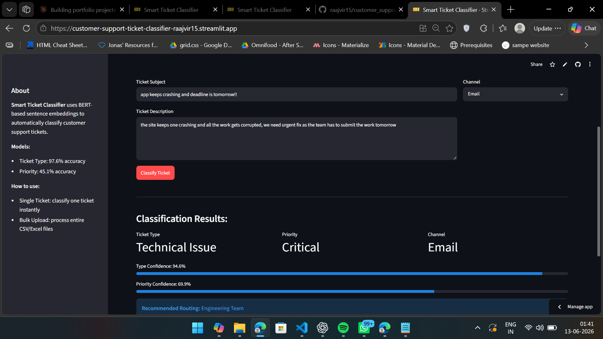
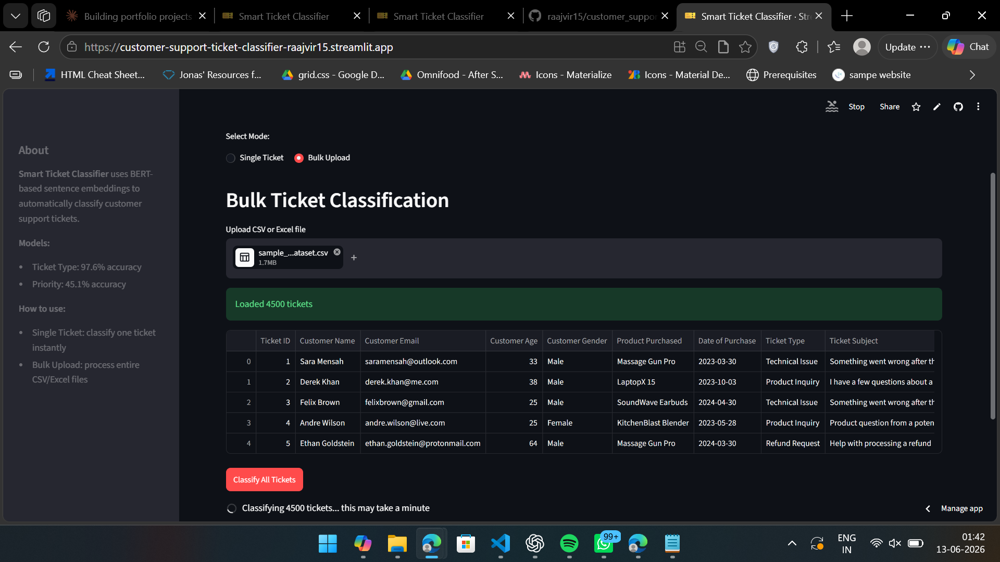
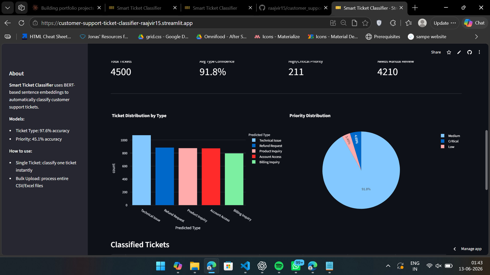

# 🎫 Smart Customer Support Ticket Classifier

An NLP-powered web app that automatically classifies customer support tickets by type and priority using BERT sentence embeddings — deployed for real-time single ticket and bulk CSV processing.

## Live App

https://customer-support-ticket-classifier-raajvir15.streamlit.app/

## Screenshots

### Single Ticket



### Bulk Upload



### Dashboard



## What It Does

Customer support teams receive hundreds of tickets daily. Manually reading and routing each one is slow and inconsistent. This app automates that process:

* Upload a CSV of support tickets or type a single ticket
* Get automatic category classification (Technical Issue, Billing Inquiry, Refund Request, Account Access, Product Inquiry)
* Get priority prediction with confidence score
* Get team routing recommendation
* Download classified results as CSV

## Model Performance

| Model       | Algorithm                  | Accuracy | Notes                     |
| ----------- | -------------------------- | -------- | ------------------------- |
| Ticket Type | BERT + Logistic Regression | 97.6%    | Production ready          |
| Priority    | BERT + SVM (C=100, RBF)    | 45.1%    | Directional guidance only |

## Honest Limitations

**Priority prediction is genuinely hard from text alone.**

After testing Logistic Regression, Random Forest, SVM, and feature engineering with 5 different approaches, all models converged around 41-45% accuracy.

Root cause: The dataset contains tone-mismatched tickets — critical issues described in calm language and minor issues described dramatically. Text-based models cannot reliably distinguish business urgency from emotional tone.

In production, priority prediction requires additional signals beyond text — customer tier, account history, SLA commitments. The app displays confidence scores so users know when to trust the prediction vs manually review.

## Project Journey — Dataset Challenges

This project involved significant dataset iteration before achieving reliable results.

### Attempt 1 — Public Kaggle Dataset (8,469 rows)

Downloaded a popular customer support dataset.

All ticket descriptions were templated placeholders like `{product_purchased}` — no real text signal.

Both models achieved ~20% accuracy (random chance for 5 classes).

Diagnosed via cross-tab analysis showing every subject mapped to all 5 ticket types.

### Attempt 2 — Synthetic Dataset v1 (2,000 rows)

Generated synthetic data.

Model achieved 100% accuracy — initially suspicious.

Diagnosed train-test overlap: 604 identical samples in both train and test sets due to duplicate descriptions.

Model was memorizing, not learning.

### Attempt 3 — Synthetic Dataset v2 (4,500 rows)

Regenerated with uniqueness constraints.

Zero overlap confirmed.

However 2,899 duplicate rows (64%) remained — same root cause, different manifestation.

### Final Dataset (4,500 rows, 6 duplicates)

Carefully generated with:

* 5 balanced ticket categories (~900 each)
* 30% ambiguous tickets (billing vs refund, technical vs account access)
* 7% vague tickets with minimal signal
* 20% informal language with typos
* Tone-mismatched tickets (calm-critical, dramatic-low)

Result: 97.6% type classification accuracy with zero train-test overlap confirmed.

## Tech Stack

| Tool                  | Purpose                                |
| --------------------- | -------------------------------------- |
| sentence-transformers | BERT embeddings (all-MiniLM-L6-v2)     |
| scikit-learn          | Logistic Regression, SVM, GridSearchCV |
| Streamlit             | Web application                        |
| Plotly                | Interactive charts                     |
| Pandas                | Data processing                        |
| joblib                | Model serialization                    |

## Project Structure

```text
customer_support_ticket_classifier/

├── Dataset/
│   └── sample_tickets_dataset.csv

├── notebooks/
│   ├── 01_EDA.ipynb
│   ├── 02_preprocessing.ipynb
│   ├── 03_model_type.ipynb
│   └── 04_model_priority.ipynb

├── models/
│   ├── type_classifier.pkl
│   ├── priority_classifier.pkl
│   ├── le_type.pkl
│   └── le_priority.pkl

├── app.py
├── requirements.txt
└── README.md
```

## How To Run Locally

```bash
git clone https://github.com/raajvir15/customer_support_ticket_classifier
cd customer_support_ticket_classifier
python -m venv venv
.\venv\Scripts\activate
pip install -r requirements.txt
streamlit run app.py
```

## Notebooks

| Notebook          | Description                                              |
| ----------------- | -------------------------------------------------------- |
| 01_EDA            | Distribution analysis, heatmaps, text length             |
| 02_preprocessing  | Text cleaning, label encoding, deduplication             |
| 03_model_type     | BERT embeddings, Logistic Regression, 97.6% accuracy     |
| 04_model_priority | 5 approaches tested, SVM GridSearch, honest 45.1% result |

## Key Learnings

* **100% accuracy is a red flag** — always verify train-test overlap before trusting results
* **Dataset quality beats model complexity** — 3 datasets failed before finding one with real signal
* **BERT embeddings** capture semantic meaning beyond keyword matching — critical for noisy real-world text
* **Priority prediction from text alone has a ceiling** — business context signals matter more than language
* **Honest evaluation beats optimistic reporting** — 45.1% with full explanation is more credible than inflated numbers
* **Rule-based vs ML is an engineering decision** — sometimes simpler approaches are more appropriate
